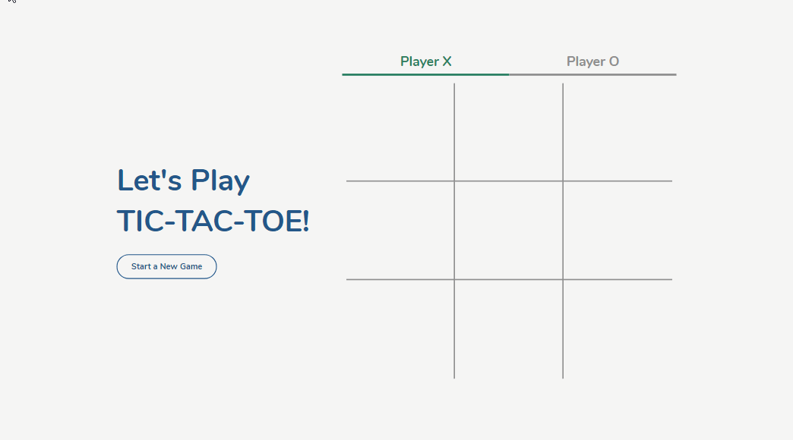
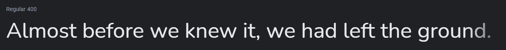

# Simple TIC-TAC-TOE Game

This is a fully responsive simple tic-tac-toe game written in HTML, CSS, and JavaScript.

**LIVE DEMO** - https://tic-tac-toe-annie.netlify.app/

    
    
    
    
    

    

## Table of Contents

- [Design](#design)
  - [Fonts](#fonts)
  - [Color Scheme](#color-scheme)
- [Built With](#built-with)
- [Contributing](#contributing)
- [Creator / Maintainer](#creator--maintainer)
- [Acknowledgments](#acknowledgments)

---

## Design

### Fonts

[Nunito](https://fonts.google.com/specimen/Nunito) - this font is used for everything because it looks good in titles and the 'X' and 'O' in the game

### Color Scheme

- Bdazzled Blue - title and new game button
- Generic Viridian - Player X text and tile color
- Blood Red - Player O text and tile color
- Cultured - website background color
- Spanish Gray - inactive player, game grid borders, tile hover, and winner's tiles background color

---

## Built With

- [HTML5](https://www.w3schools.com/html/)
- [CSS3](https://www.w3schools.com/css/)
- [JavaScript](https://www.w3schools.com/js/DEFAULT.asp)
- Hosted on [Netlify](https://www.netlify.com/)

---

## Creator

Annie Wu ([anniedotexe](https://github.com/anniedotexe))

Copyright &copy; 2021-2026 Annie Wu. All rights reserved.

Unauthorized copying, reproduction, redistribution, or posting of this content or source code on any website, platform, or medium is strictly prohibited without explicit written permission from the author. Any use, modification, or distribution of this material without permission may violate copyright law.

If you like my content or find this code useful, give it a ⭐ or support me by buying me a coffee ☕💙

